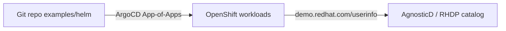

# From 3scale to Connectivity Link

Migrate API management from **Red Hat 3scale API Management** to **Red Hat Connectivity Link** (powered by [Kuadrant](https://kuadrant.io/)) with a **set of four strategies**:

| Strategy | Role |
|----------|------|
| **Developer Hub — Golden Path** | Self-service Software Template → Gitea → Argo CD → Kuadrant CRDs + catalog |
| **Kuadrant Console** | Day-2 operate API Products, keys, traffic, Swagger in OpenShift Console |
| **Migration Toolkit** | Guided wizard against a live 3scale Admin API (no AI) |
| **APIShift** | Same migration core as the Toolkit + AI assist + Developer Hub registration |

## Official Product Documentation

| Product | Documentation | Description |
|---------|---------------|-------------|
| **Red Hat 3scale API Management** | [docs.redhat.com/3scale](https://docs.redhat.com/en/documentation/red_hat_3scale_api_management/) | Full-lifecycle API management with APIcast gateway, developer portal, and analytics. Authentication via OIDC, API Key, or App ID/Key. Rate limiting via Application Plans. |
| **Red Hat Connectivity Link** | [docs.redhat.com/connectivity-link](https://docs.redhat.com/en/documentation/red_hat_connectivity_link/) | Kubernetes-native API connectivity built on Gateway API and Kuadrant. Policies for auth (AuthPolicy), rate limiting (RateLimitPolicy), TLS, and DNS — attached directly to Gateway or HTTPRoute resources. |
| **Red Hat Developer Hub** | [docs.redhat.com/rhdh](https://docs.redhat.com/en/documentation/red_hat_developer_hub/) | Enterprise Backstage-based internal developer portal. Software Templates automate scaffolding, CI/CD setup, and catalog registration. |
| **Kuadrant (upstream)** | [docs.kuadrant.io](https://docs.kuadrant.io/) | Open-source project extending Gateway API with AuthPolicy, RateLimitPolicy, DNSPolicy, and TLSPolicy. |

## Why Migrate from 3scale to Connectivity Link?

| Aspect | 3scale | Connectivity Link |
|--------|--------|-------------------|
| **API Gateway** | APIcast (NGINX-based, proprietary config) | Istio Gateway (Envoy-based, Gateway API standard) |
| **Configuration** | Admin UI / REST API / Operator CRDs | Kubernetes CRDs + GitOps (ArgoCD) |
| **Routing** | MappingRules (method + pattern → metric) | HTTPRoute (Gateway API standard) |
| **Auth** | Product-level OIDC / API Key config | AuthPolicy / OIDCPolicy per HTTPRoute |
| **Rate Limiting** | Application Plans | RateLimitPolicy + PlanPolicy |
| **Dev Portal** | 3scale built-in CMS | Kuadrant APIProduct + Backstage |
| **GitOps** | Partial (Operator CRDs) | Native (all config is YAML in Git) |
| **Standards** | Proprietary | Gateway API (CNCF standard) |
| **Observability** | 3scale Analytics | Prometheus/Grafana + OpenTelemetry + Kiali |

## Overview

This repository provisions a complete migration workshop environment on OpenShift:

1. **3scale environment** (source): Neuralbank (OIDC) + NFL Wallet (API Key) secured by 3scale
2. **Connectivity Link environment** (target): Same apps secured by Kuadrant/Istio Gateway API
3. **Four migration strategies**: Developer Hub Golden Path, Kuadrant Console, Migration Toolkit, APIShift
4. **Side-by-side comparison**: Both environments coexist for validation

## Architecture


### Components

| Component | Purpose |
|-----------|---------|
| **Developer Hub** | Self-service developer portal (Backstage) with software templates including migration template |
| **Red Hat 3scale** | Source API management platform: APIcast gateway, Products, Application Plans ([docs](https://docs.redhat.com/en/documentation/red_hat_3scale_api_management/)) |
| **Red Hat Connectivity Link** | Target API management: Kuadrant AuthPolicy, RateLimitPolicy, PlanPolicy, APIProduct ([docs](https://docs.redhat.com/en/documentation/red_hat_connectivity_link/)) |
| **ArgoCD** | GitOps continuous delivery, auto-syncs scaffolded apps from Gitea |
| **Tekton Pipelines** | CI/CD pipelines: git-clone → maven-build → buildah → deploy |
| **DevSpaces** | Cloud-based developer workspaces with pre-configured devfiles |
| **Gitea** | In-cluster Git server for scaffolded application repos (200 users) |
| **Keycloak** | Identity provider for backstage and neuralbank realms (200 users) |
| **Istio / Gateway API** | Service mesh with Gateway, HTTPRoute per scaffolded service |
| **Kuadrant** | API management engine: Authorino (auth) + Limitador (rate limiting) |
| **Showroom** | Antora-based workshop lab guide |
| **OLS (Lightspeed)** | AI assistant with MCP Gateway integration |
| **LiteMaaS** | LLM proxy for model access |
| **APIShift** | Migration GUI with the same core path as Migration Toolkit, plus **AI model assist** and Developer Hub registration (`helmApps.apishift`). Chart: [Everything-is-Code/apishift](https://github.com/Everything-is-Code/apishift) |
| **Migration Toolkit RHCL** | Guided Mushino GUI for 3scale → Connectivity Link (`helmApps.migration-toolkit-rhcl`). Docs: [Everything-is-Code/migration-toolkit-rhcl](https://github.com/Everything-is-Code/migration-toolkit-rhcl) |
| **Kuadrant Console** | OpenShift Console plugin for Connectivity Link (`connectivityLink.apps` → `kuadrant-console`). Source: [gateway-smashes/kuadrant-console](https://github.com/gateway-smashes/kuadrant-console) |

### Migration strategies deep dive

This quickstart ships **four strategies**. The **Developer Hub Golden Path** is the GitOps Software Template. **APIShift** and **Migration Toolkit** perform the same 3scale → Connectivity Link migration; APIShift additionally supports **AI models** (via `litemaas`) and Developer Hub catalog registration. **Kuadrant Console** covers day-2 API product / key / metrics operations.


#### Kuadrant Console (`kuadrant-console`)

OpenShift Console **dynamic plugin** (display name: *Connectivity Link*) that operates on Kuadrant CRDs through the Console API proxy.

| Capability | Details |
|------------|---------|
| **API Products** | List/detail for `APIProduct`, discovered plans, OpenAPI / Swagger UI deep links |
| **API Keys** | Create Secret + `APIKey` CR, approve/reject via label workflow, Reveal Key from referenced Secret |
| **Traffic & cost** | Overview metrics via Thanos/Prometheus; deep links into Grafana RHCL dashboards |
| **Traces** | Tempo deep links when a `TempoStack` / Tempo monolith is present |
| **Namespace** | `kuadrant-console` |
| **Plugin name** | `kuadrant-console` |
| **Image** | `quay.io/gateway-smashes/kuadrant-console:1.5.1` |

Helm entry: `connectivityLink.apps` → `id: kuadrant-console` (local chart [`examples/helm/components/kuadrant-console`](examples/helm/components/kuadrant-console)). Upstream: [gateway-smashes/kuadrant-console](https://github.com/gateway-smashes/kuadrant-console). Demo APIs + gateway live in `kuadrant-console-demo`.

#### Migration Toolkit RHCL (`migration-toolkit-rhcl`)

Quarkus backend + PatternFly frontend that walks operators through connecting to 3scale, discovering Products/Backends, and generating Connectivity Link manifests. Same core migration path as APIShift; does **not** integrate AI models.

| Item | Value |
|------|-------|
| **Route** | `https://migration-toolkit.<cluster-domain>` |
| **Namespace** | `migration-toolkit` |
| **Images** | `quay.io/everythingascode/migration-toolkit-rhcl-{backend,frontend}:v0.1.0` |
| **Defaults** | `THREESCALE_DEFAULT_URL` / `THREESCALE_DEFAULT_TOKEN` (via Helm `backend.threescale.*`) pre-fill the Connection form (`GET /api/defaults`) |
| **Storage** | In-cluster PostgreSQL |
| **Docs** | [Everything-is-Code/migration-toolkit-rhcl](https://github.com/Everything-is-Code/migration-toolkit-rhcl) |

#### APIShift (`apishift`)

Same migration capabilities as Migration Toolkit RHCL (discover 3scale → generate Connectivity Link policies), with two extras: **AI model assist** (`litemaas.*`) and **Developer Hub** registration via the Scaffolder API.

| Item | Value |
|------|-------|
| **Route** | `https://gateforge-gateforge.<cluster-domain>` (cluster host; product name is APIShift) |
| **Namespace** | `gateforge` |
| **3scale** | `threescale.adminApi.url` + `accessToken` (set in ArgoCD `valuesObject`, not committed) |
| **Developer Hub** | `developerHub.scaffolderToken` = RHDH `BACKEND_SECRET` |
| **AI assist** | LiteMaaS / MaaS endpoint + model from `litemaas.*` (differentiation vs Migration Toolkit) |
| **Images** | `quay.io/everythingascode/gateforge-{backend,frontend}:latest` |

> **Tip:** After a fresh deploy, verify APIShift can register catalog entities. A `401` on `confirm-registration` usually means `scaffolderToken` is still the placeholder — patch the ArgoCD Application `field-content-helm-apishift` with the real `secrets-rhdh` / `BACKEND_SECRET` value.

### Software Templates

Each template generates a full application with CI/CD pipeline, Connectivity Link manifests (Gateway, HTTPRoute, AuthPolicy, RateLimitPolicy), DevSpaces devfile, and catalog registration.

| Template | Type | Description |
|----------|------|-------------|
| **migrate-3scale-to-cl** | Migration | Generic template that migrates any app from 3scale to Connectivity Link. Supports OIDC and API Key auth models. Generates Gateway, HTTPRoute, AuthPolicy, RateLimitPolicy, PlanPolicy, APIProduct. |
| **customer-service-mcp** | Quarkus MCP Server | MCP server with `@Tool`/`@ToolArg` annotations, REST client to backend, SSE transport. Includes MCP Inspector in DevSpaces. |
| **neuralbank-backend** | Quarkus REST API | Credit management API (`/api/customers`, `/api/credits`, `/api/credits/{id}/update`) |
| **neuralbank-frontend** | Static HTML/CSS/JS | Credit visualization SPA with Neuralbank theme (Red Hat palette) |

### Pre-deployed Migration Scenarios

| Namespace | Platform | Auth Model | Purpose |
|-----------|----------|------------|---------|
| `neuralbank-3scale` | 3scale | OIDC (Keycloak) | Source — Neuralbank secured by 3scale Product with OIDC |
| `neuralbank-stack` | Connectivity Link | OIDC (OIDCPolicy) | Target — Neuralbank secured by Kuadrant OIDCPolicy |
| `nfl-wallet-3scale` | 3scale | API Key (user_key) | Source — NFL Wallet secured by 3scale Product with API Key |
| `nfl-wallet-prod` | Connectivity Link | API Key (AuthPolicy) | Target — NFL Wallet secured by Kuadrant AuthPolicy |

### Scaffolding Flow (End-to-End CI/CD)

All scaffolder steps use only actions registered in this RHDH instance:

| Step | Scaffolder Action | Description |
|------|-------------------|-------------|
| 1 | `fetch:template` | Generates skeleton from template, injects user values (name, owner, namespace, clusterDomain). Creates unique name `owner-name` to avoid multi-user conflicts |
| 2 | `publish:gitea` | Pushes generated code to Gitea `ws-userN` organization (plugin: `backstage-plugin-scaffolder-backend-module-gitea`) |
| 3 | `catalog:register` | Registers Component + API + System entities in the Backstage catalog with owner-prefixed unique names |
| 4 | `http:backstage:request` | Creates ArgoCD Application via K8s API proxy (`/api/proxy/k8s-api/`) with unique name `owner-name` |
| 5 | `http:backstage:request` | Creates Gitea webhook via Gitea API proxy (`/api/proxy/gitea/`) |
| 6 | `http:backstage:request` | Sends notification to owner via `/api/notifications` (in-app + email via Mailpit) |

```
User in Developer Hub
  → Selects Software Template (neuralbank-backend / frontend / customer-service-mcp)
    → Step 1: fetch:template → generates skeleton with user values (uniqueName = owner-name)
    → Step 2: publish:gitea → pushes to Gitea ws-userN org
    → Step 3: catalog:register → registers Component + API + System in catalog (owner-prefixed)
    → Step 4: http:backstage:request → POST K8s API → creates ArgoCD Application (owner-name)
    → Step 5: http:backstage:request → POST Gitea API → creates push webhook
    → Step 6: http:backstage:request → POST /api/notifications → notifies owner (in-app + email)
    → ArgoCD auto-syncs manifests/ → Deploys to userN-neuralbank namespace:
        Deployment + Service
        Gateway (Istio/Gateway API)
        HTTPRoute
        OIDCPolicy (Keycloak backstage realm)
        RateLimitPolicy (60 req/min per user)
        Pipeline + TriggerTemplate + TriggerBinding + EventListener
        Initial PipelineRun (first build)
    → On git push → Gitea webhook → EventListener → New PipelineRun
```

### Dynamic Plugins Enabled

| Plugin | Source | Purpose |
|--------|--------|---------|
| `backstage-community-plugin-rbac` | Built-in | Role-based access control |
| `backstage-community-plugin-catalog-backend-module-keycloak-dynamic` | Built-in | Keycloak user/group sync to catalog |
| `backstage-plugin-kubernetes-backend` | OCI overlay | Kubernetes resource viewer |
| `backstage-plugin-scaffolder-backend-module-gitea` | OCI overlay | `publish:gitea` scaffolder action |
| `backstage-community-plugin-tekton` | OCI overlay | Tekton CI tab on entity pages |
| `backstage-community-plugin-topology` | Built-in | Kubernetes topology view |
| `roadiehq-scaffolder-backend-module-http-request-dynamic` | Built-in | `http:backstage:request` scaffolder action |
| `roadiehq-backstage-plugin-argo-cd-backend-dynamic` | Built-in | ArgoCD status on entity pages |
| `@kuadrant/kuadrant-backstage-plugin-backend-dynamic` | External | Kuadrant API Product provider |
| `@kuadrant/kuadrant-backstage-plugin-frontend` | External | Kuadrant UI (API Products, API Keys) |
| `backstage-plugin-notifications` | Built-in | In-app notifications system |
| `backstage-plugin-notifications-backend-module-email-dynamic` | Built-in | Email notifications processor (SMTP/Mailpit) |
| `red-hat-developer-hub-backstage-plugin-lightspeed` | OCI overlay | Red Hat Developer Lightspeed AI assistant (frontend) |
| `red-hat-developer-hub-backstage-plugin-lightspeed-backend` | OCI overlay | Red Hat Developer Lightspeed AI assistant (backend) |

### Backstage Proxy Endpoints

| Proxy Path | Target | Auth | Used By |
|------------|--------|------|---------|
| `/api/proxy/gitea/*` | `https://gitea-gitea.<domain>/api/v1` | Basic (gitea_admin) | Webhook creation in scaffolder |
| `/api/proxy/k8s-api/*` | `https://kubernetes.default.svc` | Bearer (SA token) | ArgoCD Application creation in scaffolder |

**User sees in Developer Hub:**
- Topology view (Deployments, Pods, Routes, Gateways)
- Tekton CI tab (PipelineRuns, task logs) — via `janus-idp.io/tekton` annotation
- ArgoCD CD tab (sync status, health)
- Kubernetes tab (pods, events)
- API documentation (OpenAPI)
- Kuadrant API Product info (OIDCPolicy, RateLimitPolicy, API keys)
- Component relationships (System graph: frontend → backend → MCP)
- Notifications (in-app bell + email via Mailpit)
- Lightspeed AI assistant (contextual help with RAG)

## User Scaling

User count is controlled by a single parameter in `values.yaml`:

```yaml
userCount: 200  # Default: 200. Adjust as needed (30, 50, 100, 200).
```

This parameter drives all user provisioning via Helm `range` loops:

| Resource | Template | Per-User Objects |
|----------|----------|-----------------|
| Keycloak users (`user1`…`userN`) | `connectivity-link-rhbk` | 1 user in backstage realm |
| DevSpaces namespaces (`userN-devspaces`) | `connectivity-link-namespaces` | Namespace + 3 RoleBindings |
| Neuralbank namespaces (`userN-neuralbank`) | `connectivity-link-namespaces` | Namespace + 3 RoleBindings |
| Gitea users + organizations (`ws-userN`) | `connectivity-link-gitea` | 1 user + 1 org |
| ArgoCD ApplicationSets | `connectivity-link-applicationsets` | 1 ApplicationSet (SCM Provider) |
| Backstage RBAC assignments | `connectivity-link-developer-hub` | 1 policy line (`role:default/authenticated`) |
| Workshop registration seats | `connectivity-link-workshop-registration` | 1 seat (up to `maxUsers`) |

### Pre-deployed Components (Neuralbank Stack)

The `neuralbank-stack` namespace contains a pre-deployed demo application (backend + frontend + PostgreSQL) visible to all users via the Developer Hub catalog. Components are registered with `backstage.io/kubernetes-id` annotations for topology visualization.

### Access Model: Developer Hub as Single Pane of Glass

Users interact exclusively through **Developer Hub** — no OpenShift Console access required:

| Capability | Where | How |
|------------|-------|-----|
| Deploy apps | Developer Hub → Create | Software Templates |
| View topology | Developer Hub → Component → Topology tab | `backstage-community-plugin-topology` |
| View pipelines | Developer Hub → Component → CI tab | `backstage-community-plugin-tekton` + `janus-idp.io/tekton` annotation |
| View GitOps status | Developer Hub → Component → CD tab | `roadiehq-backstage-plugin-argo-cd-backend-dynamic` |
| View pods/events | Developer Hub → Component → Kubernetes tab | `backstage-plugin-kubernetes-backend` |
| Edit code | Developer Hub → Component → Open in Dev Spaces | DevSpaces with Keycloak OIDC auth |
| AI assistance | Developer Hub → Lightspeed | `red-hat-developer-hub-backstage-plugin-lightspeed` |
| API documentation | Developer Hub → API entity | OpenAPI definition |
| Notifications | Developer Hub → Bell icon | In-app + email via Mailpit |

### DevSpaces Authentication via Keycloak OIDC

DevSpaces is configured to authenticate users via the same **Keycloak OIDC** provider used by Developer Hub, eliminating the need for OpenShift user accounts:

```yaml
# CheCluster spec.networking.auth
auth:
  identityProviderURL: "https://rhbk.<cluster-domain>/realms/backstage"
  oAuthClientName: devspaces
  oAuthSecret: devspaces-oidc-secret
```

A `devspaces` OIDC client is registered in the Keycloak `backstage` realm. DevSpaces auto-provisions `<username>-devspaces` namespaces using its operator ServiceAccount.

**Result**: Users only need a Keycloak account (`user1`…`userN`) to access Developer Hub AND DevSpaces. No OpenShift User objects or manual RBAC required.

### Cluster Sizing

#### Per-User Resource Footprint

| Component | CPU (limit) | RAM (limit) |
|-----------|------------|------------|
| DevSpaces workspace (UDI + Maven cache) | 2 vCPU | 3 Gi |
| customer-service-mcp (Quarkus) | 500m | 512 Mi |
| neuralbank-backend (Quarkus) | 500m | 512 Mi |
| neuralbank-frontend (httpd) | 200m | 128 Mi |
| Istio sidecar gateways (×3) | 300m | 384 Mi |
| **Total per user (all 3 apps + DevSpaces)** | **3.5 vCPU** | **4.5 Gi** |
| **Total per user (all 3 apps, no DevSpaces)** | **1.5 vCPU** | **1.5 Gi** |

#### Infrastructure Overhead (fixed, independent of user count)

| Layer | CPU (limits) | RAM (limits) | Disk |
|-------|-------------|-------------|------|
| OpenShift Platform (API server, etcd, ingress, monitoring) | 14 vCPU | 34 Gi | 220 GB |
| Infrastructure Services (ArgoCD, Keycloak, Gitea, Developer Hub, Tekton, Istio, Kuadrant) | 36 vCPU | 54 Gi | 135 GB |
| Container Images (pre-pulled) | — | — | 113 GB |
| **Fixed total** | **50 vCPU** | **88 Gi** | **468 GB** |

#### Operator / Stack Footprint (approximate steady-state)

Use this table when sizing a **quickstart / demo** cluster before applying `userCount` scaling:

| Stack | Namespace(s) | Approx RAM | Notes |
|-------|--------------|------------|-------|
| **Service Mesh (Istio ambient)** | `istio-system`, `istio-cni`, `ztunnel` | ~4 Gi | Ambient profile + gateway pods |
| **Connectivity Link / Kuadrant** | `kuadrant-system` | ~2 Gi | Authorino + Limitador + RHCL operator |
| **Observability** | `openshift-cluster-observability-operator`, `openshift-tempo`, OTel | ~3 Gi | Grafana, Thanos querier, Tempo, collectors |
| **Developer Hub** | `developer-hub`, `rhdh-operator` | ~2 Gi | Backstage + dynamic plugins |
| **3scale** | `3scale-system` | ~4 Gi | APIcast + system + zync |
| **Migration UIs** | `gateforge`, `migration-toolkit`, `kuadrant-console` | ~1.5 Gi | APIShift + Migration Toolkit + console plugin |
| **Identity / SCM** | `rhbk-operator`, `gitea` | ~3 Gi | Keycloak + Gitea + DB |

#### Quickstart Cluster Profiles (control plane + workers)

| Profile | Users | Control plane | Workers | Worker size (each) | When to use |
|---------|-------|---------------|---------|--------------------|-------------|
| **Minimum viable** | ~30 | 3 masters | **3** | 16 vCPU / 64 Gi | Smoke test / PoC without full DevSpaces load |
| **Standard demo** | ~100 | 3 masters | **6** | 16–32 vCPU / 64–128 Gi | Side-by-side 3scale + CL + migration UIs |
| **Full workshop** | 200 | 3 masters (**16 vCPU / 64 Gi**) | **8–12** | 32 vCPU / 128 Gi (m5.8xlarge) | RHDP workshop with concurrent DevSpaces |

#### Scaling at 200 Users — Key Considerations

At 200 users the following platform components become scale-sensitive:

| Component | Impact at 200 users | Recommendation |
|-----------|-------------------|----------------|
| **ArgoCD Application Controller** | 200 ApplicationSets + up to 600 Applications | Increase memory limit to 8 Gi; consider `--sharding-algorithm round-robin` with 2 replicas |
| **ArgoCD Repo Server** | Clones up to 600 repos | Scale to 2 replicas, increase CPU/memory limits |
| **etcd / API Server** | 400+ namespaces, 1200+ RoleBindings, 600+ ArgoCD Applications | Ensure control plane nodes have ≥16 Gi RAM and fast SSD storage |
| **Keycloak** | 200 user sessions | Scale to 2 replicas if login storms expected |
| **Gitea** | 200 users, 200 orgs, up to 600 repos | Monitor PostgreSQL/SQLite I/O; consider external DB for >100 users |

#### Scaling Profiles

| Users | User Resources | Total (infra + users) | Recommended Workers | Instance Type |
|-------|---------------|----------------------|-------------------|---------------|
| **30** | 105 vCPU / 135 Gi | 155 vCPU / 223 Gi | 3 nodes | m5.8xlarge (32 vCPU, 128 Gi) |
| **50** | 175 vCPU / 225 Gi | 225 vCPU / 313 Gi | 4 nodes | m5.8xlarge |
| **100** | 350 vCPU / 450 Gi | 400 vCPU / 538 Gi | 7 nodes | m5.8xlarge |
| **100** (no DevSpaces) | 150 vCPU / 150 Gi | 200 vCPU / 238 Gi | 4 nodes | m5.8xlarge |
| **200** | 700 vCPU / 900 Gi | 750 vCPU / 988 Gi | **12 nodes** | **m5.8xlarge (32 vCPU, 128 Gi)** |
| **200** (no DevSpaces) | 300 vCPU / 300 Gi | 350 vCPU / 388 Gi | **6 nodes** | **m5.8xlarge** |
| **200** (30% DevSpaces concurrent) | 420 vCPU / 480 Gi | 470 vCPU / 568 Gi | **8 nodes** | **m5.8xlarge** |

> **Recommended for 200 users**: **8–12 worker nodes** (m5.8xlarge: 32 vCPU, 128 Gi each), depending on DevSpaces concurrency. In practice, not all 200 users run DevSpaces workspaces simultaneously — with 30% concurrent DevSpaces usage, 8 workers suffice. If all users deploy all 3 templates AND use DevSpaces concurrently, scale to 12 workers.

> **Note**: Without DevSpaces (users only view topology/CI/CD in Developer Hub), per-user footprint drops to **1.5 vCPU / 1.5 Gi** — enabling 200 users on a 6-worker cluster.

Control plane: 3 masters with **16 vCPU, 64 Gi RAM, 200 GB SSD** each (upgraded from standard 8 vCPU / 32 Gi for 200-user deployments due to etcd and API server load from 400+ namespaces).

> **Warning**: Single-node (SNO) deployments are not supported for >30 users. Standard 3-master control plane with 8 vCPU / 32 Gi is sufficient up to 100 users; for 200 users, upgrade masters to 16 vCPU / 64 Gi.

#### RHDP Provisioning (KubeVirt / OpenShift CNV)

When ordering from RHDP, the provisioning form exposes three parameters for worker nodes:

| Parameter | Description |
|-----------|-------------|
| **OpenShift Worker count** | Number of KubeVirt worker VMs to create |
| **OpenShift Worker memory** | Guest memory per worker VM |
| **OpenShift Worker CPU** | vCPU cores per worker VM |

##### Resource Quota Considerations

RHDP environments have memory quotas applied to the sandbox namespace. The total quota covers all resources: control planes, bastion, workers, and system pods. The infrastructure base (control planes + bastion + overhead) consumes a significant portion of the quota, so plan worker sizing carefully to avoid exceeding the limit.

> **Important**: Exceeding the namespace quota causes worker VM creation to fail. The error manifests as the `virt-launcher` pod being forbidden, and the provisioning task exhausts all retries. Always verify available quota before ordering.

##### Recommended RHDP Values

| Users | Worker count | Worker memory | Worker CPU | Total worker resources |
|-------|-------------|--------------|-----------|----------------------|
| **100** | **4** | **128Gi** | **32** | 512Gi RAM / 128 vCPU |
| **100** (conservative) | **5** | **64Gi** | **16** | 320Gi RAM / 80 vCPU |
| **200** | **6** | **128Gi** | **32** | 768Gi RAM / 192 vCPU |
| **200** (conservative) | **8** | **64Gi** | **16** | 512Gi RAM / 128 vCPU |

> **Important**: The maximum number of 128Gi workers that fit under the sandbox quota is **6** (not 7). Each worker VM's virt-launcher pod requests ~257Gi (128Gi guest + overhead), and the infrastructure base (3 control-plane nodes + bastion + system pods) consumes ~1,037Gi of the 2,000Gi quota. Requesting a 7th 128Gi worker will fail with `exceeded quota: sandbox-quota`.
>
> **Tip**: When in doubt, start with fewer large workers rather than many small ones, and verify quota availability before scaling up.

##### Provisioning Time

| Configuration | Workers | Time (approx.) |
|---------------|---------|----------------|
| 200 users, 128Gi workers | 6 nodes | ~43 minutes |

> Measured on RHDP KubeVirt environment. Time includes worker VM creation, node join, operator installation, and ArgoCD initial sync of all components.

##### Sizing Rationale

| Component | Per-user footprint | 100 users (50% concurrent) | 200 users (50% concurrent) |
|-----------|-------------------|---------------------------|---------------------------|
| DevSpaces workspaces | 2–4Gi RAM, 1–2 vCPU | ~200Gi / 100 vCPU | ~400Gi / 200 vCPU |
| Scaffolded apps (3 per user) | 1.5Gi RAM, 1.5 vCPU | ~75Gi / 75 vCPU | ~150Gi / 150 vCPU |
| Infrastructure (fixed) | — | ~100–150Gi / 30–50 vCPU | ~100–150Gi / 30–50 vCPU |
| **Total worker requirement** | — | **~375–425Gi** | **~650–700Gi** |

Adjust `userCount` in `values.yaml` to match:

```yaml
# For 100 users
userCount: 100

# For 200 users
userCount: 200
```

## Configuring an AI / LLM Model (Helm values)

A single `litemaas` block feeds **OpenShift Lightspeed (OLS)**, **Developer Hub Lightspeed**, **openshift-mcp-server**, and **APIShift** AI assist. Prefer `litemaas.*` over the legacy `maas.*` aliases.

In [`examples/helm/values.yaml`](examples/helm/values.yaml):

```yaml
litemaas:
  enabled: true
  # Injected by RHDP / Argo valuesObject — never commit real keys
  apiKey: ""
  apiUrl: "https://maas-rhdp.apps.maas.redhatworkshops.io/v1"
  model: "qwen3-14b"

# Legacy aliases (fallback for older overlays)
maas:
  apiKey: ""
  endpoint: "https://maas-rhdp.apps.maas.redhatworkshops.io/v1"
  model: "qwen3-14b"

lightspeed:
  llmApiKey: ""
  llmEndpoint: "https://maas-rhdp.apps.maas.redhatworkshops.io/v1"
```

### How to add or change a model

1. Set `litemaas.apiUrl` to your MaaS / OpenAI-compatible base URL (must end with `/v1` if the provider expects that path).
2. Set `litemaas.model` to the model id exposed by the provider (example: `qwen3-14b`).
3. Supply `litemaas.apiKey` via RHDP injection or by patching the ArgoCD Application `valuesObject` / Secret — **do not commit keys**.
4. Sync ArgoCD apps that consume the value (`openshift-lightspeed`, `apishift`, MCP server). Restart pods if Secrets were patched outside Helm.

Example ArgoCD patch pattern (cluster-local only):

```bash
# After RHDP injects the key, or when rotating:
oc -n openshift-gitops patch application field-content-helm \
  --type merge -p '{"spec":{"source":{"helm":{"valuesObject":{"litemaas":{"apiKey":"<KEY>","model":"qwen3-14b"}}}}}}'
```

Also see [Manual Credentials](#manual-credentials-not-stored-in-git) for LiteLLM virtual-key wiring.

## Service Mesh Patterns (EnvoyFilter / Lua)

Connectivity Link runs on **Istio Gateway API**. When browser clients (Swagger UI, developer portals) call APIs through the same gateway origin, you often need **CORS** and header adaptation that AuthPolicy alone does not provide. This repo demonstrates that with an Istio `EnvoyFilter` Lua script on the demo gateway.


**Resource:** `EnvoyFilter/demo-gateway-cors-bearer` in [`examples/helm/components/kuadrant-console-demo/templates/all.yaml`](examples/helm/components/kuadrant-console-demo/templates/all.yaml)

| Problem | Lua / EnvoyFilter behavior |
|---------|----------------------------|
| Browser **CORS preflight** (`OPTIONS`) blocked by auth | Intercept `OPTIONS` with an `Origin` header → respond `204` with `Access-Control-Allow-*` (short-circuit; never hits Authorino) |
| Swagger UI sends `Authorization: Bearer <api-key>` but AuthPolicy expects `X-API-Key` | On request, if Bearer is present and `X-API-Key` is absent, copy the token into `x-api-key` |
| Response missing CORS headers | On response, `replace` `access-control-allow-origin` / expose headers (avoid duplicate `*,*` headers) |

**When to use this pattern**

- Swagger / Microcks / Console “Try it out” against a Kuadrant-protected gateway
- Bridging OAuth-style Bearer UX to API-key AuthPolicies without changing the backend
- Workshop demos where the OpenAPI `servers[].url` points at the **gateway**, not the mock service

**When not to use it**

- Production multi-tenant portals that need strict origin allow-lists and credentials cookies (`Access-Control-Allow-Origin: *` + credentials is invalid)
- Prefer Gateway API / Envoy extension policies if your platform version supports first-class CORS CRDs

## Getting Started

### Choose Your Pattern

| Pattern | Use When |
|---------|----------|
| [examples/helm/](examples/helm/) | Deployment can be expressed as Kubernetes manifests with Helm templating |
| [examples/ansible/](examples/ansible/) | You need wait-for-ready, secret generation, API calls, or conditional logic |

**Install path (Helm):** Point RHDP / Argo CD at [`examples/helm/`](examples/helm/). That root chart is an **App-of-Apps**: it creates child `Application` resources for the connectivity-link stack (operators, namespaces, Developer Hub, 3scale demos, showroom, migration UIs). Inside the same tree, [`components/applicationsets`](examples/helm/components/applicationsets/) (wired as `connectivityLink.apps` id `connectivity-link-applicationsets` in `values.yaml`) deploys the Argo CD **ApplicationSet** that watches Gitea and spins up per-user Applications after Golden Path scaffolds land in Git. You do not install that ApplicationSet by hand — enable the component and sync the root chart.

### Quick Start

```bash
# Clone this template
git clone https://github.com/Everything-is-Code/from-3scale-to-connectivity-link.git my-content
cd my-content

# Choose an example and start customizing
cd examples/helm      # or examples/ansible
# Edit values.yaml and templates as documented in each example's README
# Root chart = App-of-Apps; components/applicationsets = Gitea SCM ApplicationSet
```

### Setting the Cluster Domain

The cluster domain is injected by RHDP via `deployer.domain`. For manual deployments, update it with the provided script:

```bash
# Replace with your cluster's domain
./update-cluster-domain.sh apps.cluster-xxxxx.dynamic2.redhatworkshops.io
git add -A && git commit -m "update cluster domain" && git push
```

### Platform Engineer Access

Two admin users with full Platform Engineer permissions in Developer Hub:

| Username | Auth Method | Roles | Notes |
|----------|-------------|-------|-------|
| `everythingascode` | Keycloak SSO (email) | platformengineer, api-admin, api-owner | Primary admin |
| `platformadmin` | Keycloak username/password | platformengineer, api-admin, api-owner | Must be created in Keycloak manually |

**Creating `platformadmin` in Keycloak:**

```bash
KEYCLOAK_URL="https://rhbk.apps.<cluster-domain>"

# Get admin token
TOKEN=$(curl -sk "$KEYCLOAK_URL/realms/master/protocol/openid-connect/token" \
  -d "client_id=admin-cli" -d "grant_type=password" \
  -d "username=admin" -d "password=<KEYCLOAK_ADMIN_PASSWORD>" | jq -r .access_token)

# Create platformadmin user with password Welcome123!
curl -sk "$KEYCLOAK_URL/admin/realms/backstage/users" \
  -H "Authorization: Bearer $TOKEN" \
  -H "Content-Type: application/json" \
  -d '{"username":"platformadmin","enabled":true,"emailVerified":true,"credentials":[{"type":"password","value":"<CHOOSE_A_SECURE_PASSWORD>","temporary":false}]}'
```

Platform Engineer permissions include: full catalog CRUD, scaffolder execution, RBAC administration, Lightspeed chat, Kuadrant API product management (create/update/delete/approve), and Adoption Insights.

### Manual Credentials (not stored in Git)

After deploying to a new cluster, the following secrets must be updated **manually** via `oc` commands. These credentials are intentionally excluded from Git to avoid exposing sensitive data.

#### LiteLLM Virtual Key

The LiteLLM Virtual Key authenticates clients (OLS, LiteMaaS backend) against the LiteLLM proxy. Obtain it from the LiteLLM admin UI or API, then update:

```bash
# 1. OLS → LiteLLM (OpenShift Lightspeed uses this to call the LLM)
oc create secret generic llm-credentials \
  --from-literal=apitoken='<LITELLM_VIRTUAL_KEY>' \
  -n openshift-lightspeed \
  --dry-run=client -o yaml | oc apply -f -

# 2. LiteMaaS backend → LiteLLM
oc patch secret backend-secret -n litemaas \
  --type merge -p '{"stringData":{"litellm-api-key":"<LITELLM_VIRTUAL_KEY>"}}'

# 3. Restart affected pods to pick up the new key
oc rollout restart deployment/lightspeed-app-server -n openshift-lightspeed
```

| Secret | Namespace | Key | Used by |
|--------|-----------|-----|---------|
| `llm-credentials` | `openshift-lightspeed` | `apitoken` | OLS (Lightspeed) → LiteLLM |
| `backend-secret` | `litemaas` | `litellm-api-key` | LiteMaaS backend → LiteLLM |

> **Note**: After deployment, review and rotate all default secret values (LiteLLM master-key, UI password, database credentials) using the `oc patch secret` approach shown above.

### Service Access URLs

All services use the cluster domain pattern `apps.<cluster-domain>`:

| Service | URL Pattern |
|---------|-------------|
| **Developer Hub** | `https://backstage-developer-hub-developer-hub.apps.<domain>` |
| **Gitea** | `https://gitea-gitea.apps.<domain>` |
| **ArgoCD** | `https://openshift-gitops-server-openshift-gitops.apps.<domain>` |
| **DevSpaces** | `https://devspaces.apps.<domain>` |
| **Showroom** | `https://showroom-showroom.apps.<domain>` (also `showroom.apps.<domain>` on some clusters) |
| **Registration Portal** | `https://workshop-registration.apps.<domain>` |
| **Registration Admin** | `https://workshop-registration.apps.<domain>/admin` |
| **Keycloak (RHBK)** | `https://rhbk.apps.<domain>` |
| **Mailpit** | `https://n8n-mailpit-openshift-lightspeed.apps.<domain>` |
| **Grafana** | `https://grafana-observability.apps.<domain>` |
| **Kiali** | `https://kiali-openshift-cluster-observability-operator.apps.<domain>` |
| **Thanos Querier** | `https://thanos-querier.apps.<domain>` |
| **APIShift** | `https://gateforge-gateforge.apps.<domain>` |
| **Migration Toolkit** | `https://migration-toolkit.apps.<domain>` |
| **Kuadrant Console** | OpenShift Console → *Connectivity Link* plugin |
| **Microcks** | `https://microcks.apps.<domain>` |
| **Lightspeed** | Available from OpenShift Console |

### Retrieve console credentials

For all non–OpenShift-OAuth admin consoles (ArgoCD, Grafana, Gitea, Keycloak, 3scale, APIShift, Migration Toolkit, etc.):

```bash
./scripts/get-credentials.sh
```

Requires a logged-in `oc` context with cluster-admin (or equivalent) read access to Secrets and Routes.

#### Registration Portal API Endpoints

Base URL: `https://workshop-registration.apps.<domain>`

| Method | Endpoint | Auth | Description |
|--------|----------|------|-------------|
| `GET` | `/` | No | Registration form (visitors enter email) |
| `GET` | `/admin` | No | Admin dashboard login page |
| `GET` | `/api/health` | No | Health check — returns `{ status, registered, maxUsers }` |
| `POST` | `/api/register` | No | Register a visitor — body: `{ "email": "..." }`, returns `{ username, redirect }` |
| `GET` | `/api/users` | Yes | List all registered visitors — returns `{ users, maxUsers, available }` |
| `POST` | `/api/users/delete` | Yes | Remove a visitor — body: `{ "username": "userN" }` |
| `POST` | `/api/reset` | Yes | Clear all registrations |

**Auth**: endpoints marked "Yes" require the admin token via header `X-Admin-Token`, query param `?token=`, or `Authorization: Bearer <token>`.

**Example — check registered visitors:**

```bash
curl -s https://workshop-registration.apps.<domain>/api/health
curl -s -H "X-Admin-Token: <token>" https://workshop-registration.apps.<domain>/api/users
```

## How It Works

Field content is delivered as a Helm **App-of-Apps** chart under [`examples/helm/`](examples/helm/). Argo CD syncs component Applications from this Git repo into the OpenShift cluster. AgnosticD / RHDP reads `demo.redhat.com/userinfo` labels (and related ConfigMaps) to surface URLs and credentials back to the catalog.



High-level topology and migration tooling diagrams:

- 
- 

## RHDP Integration

Label resources for platform integration:

```yaml
# Health monitoring
metadata:
  labels:
    demo.redhat.com/application: "my-demo"

# Pass data back to AgnosticD (URLs, credentials, etc.)
metadata:
  labels:
    demo.redhat.com/userinfo: ""
```

## Troubleshooting with OpenShift Lightspeed (MCP)

After installation, OpenShift Lightspeed has access to **55 MCP tools** (k8s, ocp, argo, rhdh) that can diagnose and resolve most issues. Below are prompts organized by problem category, based on real issues encountered during cluster installations.

### ArgoCD Applications Not Syncing / Failed

These were the most frequent issues during installation of clusters `main` and `one`.

| Situation | Lightspeed Prompt |
|-----------|-------------------|
| Apps stuck in `OutOfSync` or `Failed` | _"List all ArgoCD applications and show me which ones are not synced"_ |
| App stuck in `Progressing` for a long time | _"Get the resource events for the application field-content-mcp-gateway"_ |
| Need to force sync an app | _"Sync the application field-content-developer-hub"_ |
| ApplicationSets failing | _"Get the application details for field-content-connectivity-link-applicationsets and show me the error"_ |
| Sync wave ordering issues | _"Show me the resource tree for field-content-ols"_ |
| Need to see what resources an app manages | _"Get the managed resources of type Deployment for application field-content-mcp-gateway"_ |
| ArgoCD overwriting manual patches (selfHeal) | _"Get the application details for field-content-mcp-gateway and check its sync policy"_ |

### Developer Hub (RHDH) Issues

Developer Hub was prone to configuration errors, especially around Keycloak integration and Gitea connectivity.

| Situation | Lightspeed Prompt |
|-----------|-------------------|
| RHDH pods not starting / CrashLoopBackOff | _"Get pods in the developer-hub namespace and show me their status"_ |
| `Realm does not exist` error on RHDH login | _"Get the logs from the deployment backstage-developer-hub in namespace developer-hub"_ |
| Scaffolder fails with `No matching integration for host gitea-gitea.apps.cluster.example.com` | _"Get the configmap app-config-rhdh in namespace developer-hub and show the integrations section"_ |
| Scaffolder creates app but pipeline doesn't run | _"List events in namespace user1-neuralbank"_ |
| CI/CD tab empty in Developer Hub | _"List pipelineruns in namespace user1-neuralbank"_ |
| Dynamic plugins not loading | _"Get the logs from the deployment backstage-developer-hub in namespace developer-hub and search for plugin errors"_ |

### OpenShift Lightspeed / LLM Errors

LLM invocation errors and route issues were common when the model endpoint changed or the sandbox expired.

| Situation | Lightspeed Prompt (from another cluster or terminal) |
|-----------|-------------------|
| `An error occurred during LLM invocation` | _"Get pods in namespace openshift-lightspeed and check their status"_ |
| OLS pod showing `Application is not available` | _"Get the route in namespace openshift-lightspeed"_ |
| LLM endpoint returning errors | _"Get the OLSConfig named cluster and show me the LLM provider configuration"_ |
| MCP tools not found (`Tool 'ocp_listPods' not found`) | _"Get the OLSConfig named cluster and show me the querySystemPrompt"_ |
| LLM hallucinating tool names | _"Get the MCPServerRegistrations in namespace mcp-system and show their discovered tools"_ |

### MCP Gateway Issues

The MCP Gateway federates tools from multiple backends — connectivity issues were common.

| Situation | Lightspeed Prompt |
|-----------|-------------------|
| MCPServerRegistration stuck in `READY=False` | _"Get the MCPServerRegistrations in namespace mcp-system"_ |
| ArgoCD MCP server `CrashLoopBackOff` | _"Get the logs from deployment argocd-mcp-server in namespace mcp-system"_ |
| Gateway pods not healthy | _"Get pods in namespace mcp-system and show their status"_ |
| Tool prefix collision / wrong tools | _"List all MCPServerRegistrations in mcp-system and show prefix and tool count"_ |
| 401 errors from Kuadrant controller to backend | _"Get events in namespace mcp-system"_ |

### Showroom / Workshop Registration

| Situation | Lightspeed Prompt |
|-----------|-------------------|
| Showroom not loading / pods down | _"Get pods in namespace showroom"_ |
| `{cluster_domain}` not being replaced in showroom | _"Get the configmap showroom-env in namespace showroom"_ |
| Terminal permission errors (`Forbidden: cannot list pods`) | _"Get the clusterrolebindings that mention serviceaccount showroom"_ |
| Mermaid diagrams not rendering | _"Get the logs from the pod running in namespace showroom"_ |
| Workshop registration page not showing logo | _"Get the configmap workshop-registration-html in namespace showroom"_ |

### Pipeline / Tekton Issues

Pipelines not triggering after git push was a recurring issue, usually caused by missing webhooks or EventListeners.

| Situation | Lightspeed Prompt |
|-----------|-------------------|
| Pipeline not triggered after commit | _"List events in namespace user1-neuralbank"_ |
| Pipeline exists but never ran | _"List pipelineruns in namespace user1-neuralbank"_ |
| Pipeline stuck or failed | _"Get the pipelinerun logs in namespace user1-neuralbank"_ |
| Webhook not configured | _"List routes in namespace user1-neuralbank"_ |
| Build fails (buildah) | _"Get the logs from the latest pipelinerun in namespace user1-neuralbank"_ |

### Keycloak / Authentication

| Situation | Lightspeed Prompt |
|-----------|-------------------|
| Users can't login to Developer Hub | _"Get pods in namespace rhbk-operator and check keycloak status"_ |
| Realm `neuralbank` not created | _"Get the keycloak realm resources in namespace rhbk-operator"_ |
| OIDC flow not working on frontend | _"Get the OIDCPolicy resources in namespace user1-neuralbank"_ |

### Operator Installation

| Situation | Lightspeed Prompt |
|-----------|-------------------|
| Operator stuck in `InstallPlan` | _"List subscriptions in namespace openshift-operators"_ |
| CRD not available (SkipDryRunOnMissingResource) | _"List customresourcedefinitions that match servicemesh"_ |
| Operator degraded | _"Check the cluster health and show operator conditions"_ |

### Node / Cluster Health

| Situation | Lightspeed Prompt |
|-----------|-------------------|
| Pods pending (not enough resources) | _"Show me node resource usage"_ |
| Node not ready | _"Check node conditions"_ |
| General cluster health check | _"Check the overall cluster health"_ |
| OOMKilled pods | _"Detect resource issues across all namespaces"_ |

### Quick Diagnosis Workflow

For a fresh installation, run these prompts in sequence to validate the full stack:

```
1. "List all ArgoCD applications and show which ones are not synced or unhealthy"
2. "Get pods in namespace developer-hub and check their status"
3. "Get pods in namespace openshift-lightspeed and check their status"
4. "Get MCPServerRegistrations in namespace mcp-system"
5. "Get pods in namespace showroom"
6. "Check the overall cluster health"
```

## Documentation

- [Workshop (GitHub Pages)](https://everything-is-code.github.io/from-3scale-to-connectivity-link/) - Full workshop guide (Antora showroom)
- Showroom modules: [11 Kuadrant Console](showroom/content/modules/ROOT/pages/11-kuadrant-console.adoc) · [12 Migration Toolkit](showroom/content/modules/ROOT/pages/12-migration-toolkit.adoc) · [13 APIShift](showroom/content/modules/ROOT/pages/13-apishift-gateforge.adoc)
- [Architecture diagrams](docs/images/) - Cluster topology, migration flow, console architecture, Service Mesh EnvoyFilter
- [`scripts/get-credentials.sh`](scripts/get-credentials.sh) - Print URLs and admin credentials for non-OAuth consoles
- [Migration Specification](docs/SHOWROOM-UPDATE-SPEC.md) - 3scale vs Connectivity Link: definitions, comparison tables, migration flows
- [examples/helm/README.md](examples/helm/README.md) - Helm deployment guide
- [examples/ansible/README.md](examples/ansible/README.md) - Ansible deployment guide
- [docs/ansible-developer-guide.md](docs/ansible-developer-guide.md) - In-depth Ansible patterns
- [Kuadrant Console plugin](https://github.com/gateway-smashes/kuadrant-console)
- [Red Hat 3scale Documentation](https://docs.redhat.com/en/documentation/red_hat_3scale_api_management/) - Official 3scale docs
- [Red Hat Connectivity Link Documentation](https://docs.redhat.com/en/documentation/red_hat_connectivity_link/) - Official Connectivity Link docs

## Repository Structure

```
from-3scale-to-connectivity-link/
├── examples/
│   ├── helm/
│   │   ├── values.yaml                    # Parent chart values
│   │   ├── templates/                     # ArgoCD Application definitions
│   │   ├── components/                    # Per-component Helm sub-charts
│   │   │   ├── 3scale-operator/           # 3scale operator + APIManager
│   │   │   ├── neuralbank-3scale/         # Neuralbank on 3scale (OIDC)
│   │   │   ├── nfl-wallet-3scale/         # NFL Wallet on 3scale (API Key)
│   │   │   ├── neuralbank-stack/          # Neuralbank on Connectivity Link (OIDC)
│   │   │   ├── nfl-wallet/               # NFL Wallet on Connectivity Link (API Key)
│   │   │   ├── rhcl-operator/            # Kuadrant operator + policies
│   │   │   ├── operators/                # OLM subscriptions
│   │   │   ├── developer-hub/            # Backstage instance
│   │   │   ├── workshop-registration/    # Self-service registration portal
│   │   │   ├── showroom/                 # Workshop lab guide
│   │   │   ├── kuadrant-console/         # OpenShift Console plugin (Connectivity Link)
│   │   │   ├── kuadrant-console-demo/    # Demo APIs + EnvoyFilter CORS/Bearer
│   │   │   └── ...                       # Other infrastructure components
│   │   └── software-templates/            # Backstage scaffolder templates
│   │       ├── templates-catalog.yaml     # Auto-import catalog
│   │       ├── migrate-3scale-to-cl/      # Migration template (generic)
│   │       ├── customer-service-mcp/      # Quarkus MCP server template
│   │       ├── neuralbank-backend/        # REST API template
│   │       └── neuralbank-frontend/       # SPA frontend template
│   └── ansible/                           # Ansible-based deployment example
├── showroom/                              # Antora workshop (GitHub Pages)
│   └── content/modules/ROOT/pages/        # Modules 01–13 (incl. Console / Toolkit / APIShift)
├── scripts/
│   ├── get-credentials.sh                 # Print non-OAuth console URLs + secrets
│   ├── generate-demo-traffic.sh
│   └── check-cnv-readiness.sh
├── roles/
│   └── ocp4_workload_field_content/       # AgnosticD workload role
└── docs/                                  # Guides, migration spec, architecture PNGs
```
